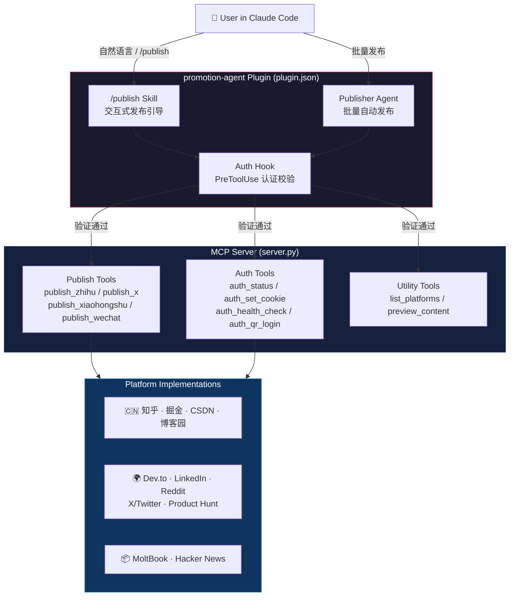

# promotion-agent

Claude Code Plugin for multi-platform social media publishing.

Supports: **知乎** · **掘金** · **CSDN** · **Dev.to** · **X/Twitter** · **LinkedIn** · **Reddit** · **Product Hunt** · **博客园** · **Hacker News** · **MoltBook**

## Installation

```bash
# Clone to Claude Code plugins directory
git clone https://github.com/ava-agent/promotion-agent ~/.claude/plugins/promotion-agent

# Install Python dependencies
cd ~/.claude/plugins/promotion-agent
pip install -e .

# (可选) 安装 Playwright，用于掘金/CSDN的浏览器自动化兜底
pip install playwright
playwright install chromium
```

## Configuration

Copy `.env.example` to `.env` and fill in your credentials:

```bash
cp .env.example .env
```

### Platform Status Overview

| Platform | Auth Type | Publish Method | Stability |
|----------|-----------|---------------|-----------|
| 知乎 | Cookie | API | ⭐⭐⭐⭐⭐ Stable |
| 掘金 | Cookie | API + Playwright fallback | ⭐⭐⭐⭐ Good |
| CSDN | Cookie | API + Playwright fallback | ⭐⭐⭐⭐ Good |
| Dev.to | API Key | API | ⭐⭐⭐⭐⭐ Stable |
| LinkedIn | OAuth Token | API | ⭐⭐⭐⭐⭐ Stable |
| Product Hunt | OAuth Token | API | ⭐⭐⭐⭐⭐ Stable |
| X/Twitter | OAuth 1.0a | API | ⭐⭐⭐⭐⭐ Stable |
| Reddit | OAuth 2.0 | API | ⭐⭐⭐⭐⭐ Stable |
| 博客园 | API Token | MetaWeblog XML-RPC | ⭐⭐⭐⭐⭐ Stable |
| MoltBook | API Key | API | ⭐⭐⭐⭐⭐ Stable |
| Hacker News | Username+Password | Web scraping | ⭐⭐ Fragile |

---

### Cookie-Based Platforms (知乎 / 掘金 / CSDN)

这三个平台使用浏览器 Cookie 认证，配置方式相同。

**方法一：自动提取（推荐）**

```bash
# 确保已在 Chrome 中登录对应平台
python3 get_cookies.py
```

脚本会自动从 Chrome/Edge/Firefox 提取 Cookie 并写入 `.env`。

**方法二：手动提取**

1. 在浏览器中登录平台
2. 按 F12 打开开发者工具 → Network 标签
3. 刷新页面，点击任意请求
4. 复制 Request Headers 中的 `Cookie` 值

```bash
# .env
PROMOTE_ZHIHU_COOKIE=_xsrf=xxx; z_c0=xxx; ...
PROMOTE_JUEJIN_COOKIE=sessionid=xxx; ...
PROMOTE_CSDN_COOKIE=UserName=xxx; uuid=xxx; ...
```

> **Note**: Cookie 有效期通常 1-3 个月，过期后需重新提取。

**掘金/CSDN Playwright 兜底**

如果 API 发布失败（掘金"参数错误"或 CSDN 403），系统会自动尝试 Playwright 浏览器自动化。需要：

```bash
# 1. 安装 Playwright
pip install playwright && playwright install chromium

# 2. 启动 Chrome（复用登录态）
/Applications/Google\ Chrome.app/Contents/MacOS/Google\ Chrome \
    --remote-debugging-port=9222 \
    --user-data-dir="/tmp/chrome_dev"

# 3. 在打开的 Chrome 中登录掘金/CSDN，之后发布会自动通过浏览器完成
```

---

### Dev.to

最简单的平台，1 分钟即可完成。

1. 登录 [dev.to](https://dev.to)
2. 进入 Settings → Account → 底部 "DEV Community API Keys"
3. 输入名称，点击 "Generate API Key"
4. 复制 Key

```bash
PROMOTE_DEVTO_API_KEY=your_api_key_here
```

---

### X / Twitter

需要 Twitter Developer 账号。

1. 访问 [developer.x.com](https://developer.x.com)
2. 创建 Project + App
3. 在 App 设置中开启 OAuth 1.0a，权限设为 **Read and Write**
4. 生成 Access Token & Secret

```bash
PROMOTE_X_CONSUMER_KEY=your_consumer_key
PROMOTE_X_CONSUMER_SECRET=your_consumer_secret
PROMOTE_X_ACCESS_TOKEN=your_access_token
PROMOTE_X_ACCESS_TOKEN_SECRET=your_access_token_secret
```

> 需要安装 `tweepy`: `pip install tweepy`

---

### LinkedIn

需要 LinkedIn Developer 应用。

1. 访问 [linkedin.com/developers](https://www.linkedin.com/developers)
2. 创建一个 App，关联 Company Page
3. 在 Products 中申请 **Share on LinkedIn** 权限
4. 通过 OAuth 2.0 获取 Access Token（使用 `w_member_social` scope）

```bash
PROMOTE_LINKEDIN_ACCESS_TOKEN=your_access_token
```

> **Note**: Token 有效期 60 天，过期后需重新获取。

---

### Product Hunt

1. 访问 [Product Hunt API Dashboard](https://www.producthunt.com/v2/oauth/applications)
2. 创建应用，获取 API Token

```bash
PROMOTE_PRODUCTHUNT_TOKEN=your_token_here
```

---

### Reddit

需要 Reddit API 应用。

1. 访问 [reddit.com/prefs/apps](https://www.reddit.com/prefs/apps)
2. 点击 "create another app..."
3. 类型选 **script**
4. redirect uri 填 `http://localhost:8080`
5. 记下 client ID（app 名下方那串字符）和 secret

```bash
PROMOTE_REDDIT_CLIENT_ID=your_client_id
PROMOTE_REDDIT_CLIENT_SECRET=your_client_secret
PROMOTE_REDDIT_USERNAME=your_username
PROMOTE_REDDIT_PASSWORD=your_password
```

> 需要安装 `praw`: `pip install praw`

---

### 博客园 (CNBlogs)

使用 MetaWeblog XML-RPC 协议。

1. 登录 [博客园](https://www.cnblogs.com)
2. 进入 [设置页面](https://i.cnblogs.com/settings)
3. 勾选 "允许 MetaWeblog 博客客户端访问"
4. 生成 API Token

```bash
PROMOTE_CNBLOGS_BLOG_URL=https://www.cnblogs.com/your-blog-name
PROMOTE_CNBLOGS_USERNAME=your_username
PROMOTE_CNBLOGS_TOKEN=your_api_token
```

---

### Hacker News

直接使用 HN 账号密码（通过网页表单提交，不太稳定）。

```bash
PROMOTE_HN_USERNAME=your_username
PROMOTE_HN_PASSWORD=your_password
```

> ⚠️ 该平台通过 HTML 表单爬取实现，无官方 API，可能因网页结构变化失效。

---

### MoltBook

```bash
PROMOTE_MOLTBOOK_API_KEY=your_api_key
# 可选：指定默认 submolt
PROMOTE_MOLTBOOK_DEFAULT_SUBMOLT=general
```

---

## How It Works — Architecture

本项目是一个 **Claude Code Plugin**，内嵌了一个 **MCP Server**。两者协同工作：



**核心组件**：

| 层级 | 组件 | 作用 |
|------|------|------|
| **交互层** | Skills (`/publish`) | 引导用户完成发布流程：选平台 → 预览 → 确认 → 发布 |
| **自动化层** | Agents (`publisher`) | 读取内容文件，按平台拆分，批量发布，输出汇总 |
| **安全层** | Hooks (`auth-check`) | `PreToolUse` 拦截所有 `publish_*` 调用，发布前自动验证认证 |
| **执行层** | MCP Server (`server.py`) | 10 个工具，通过 `plugin.json` 作为子进程启动 |
| **平台层** | Platform classes | 每个平台独立实现 `adapt_content()` + `post()` |

---

## Usage in Claude Code — 使用指南

### Step 1: Install the Plugin

```bash
# 克隆到 Claude Code 插件目录
git clone https://github.com/ava-agent/promotion-agent ~/.claude/plugins/promotion-agent

# 安装依赖
cd ~/.claude/plugins/promotion-agent
pip install -e .
```

安装后，**重启 Claude Code**，插件会自动被加载（通过 `plugin.json`）。

### Step 2: Configure Credentials

```bash
cd ~/.claude/plugins/promotion-agent
cp .env.example .env
# 编辑 .env，填入你的平台凭证（参考上方各平台配置指南）
```

### Step 3: Start Using

安装配置完成后，在 Claude Code 中有 **三种使用方式**：

#### 方式一：自然语言（最简单）

直接用自然语言告诉 Claude 你想发布什么：

```
> 帮我把这篇文章发到知乎

> Publish this markdown file to Dev.to

> 把 README.md 发布到掘金和 CSDN

> 发布到所有已配置的平台
```

Claude 会自动调用 MCP 工具完成发布。

#### 方式二：/publish Skill（交互式引导）

```
> /publish
```

`/publish` 技能会引导你完成完整流程：

1. **识别内容来源** — 读取文件或使用对话上下文
2. **选择目标平台** — 展示可用平台列表
3. **检查认证状态** — 自动验证凭证是否有效
4. **预览适配内容** — 展示各平台的适配结果（`dry_run` 模式）
5. **确认并发布** — 逐平台发布并报告结果

如果你的内容文件命名为 `*-社媒版.md`，技能会按 `## ` 标题自动拆分为各平台版本：

```markdown
## 知乎
知乎版本的内容...

## X
1/3 First tweet...
2/3 Second tweet...
3/3 Third tweet...

## 微信公众号
公众号版本的内容...
```

#### 方式三：Publisher Agent（批量自动发布）

当你需要一次性发布到多个平台时，Claude 会自动调度 **publisher** 子代理：

```
> 把这篇文章批量发布到所有平台
```

Publisher Agent 的工作流程：
1. 读取内容，按平台拆分（如有）
2. 调用 `auth_status` 验证凭证
3. 对每个平台执行 `dry_run` 预览
4. 等待确认后逐平台发布
5. 输出汇总表格（平台 | 状态 | URL | 错误信息）

---

## MCP Tools Reference

插件通过 MCP Server 暴露以下工具，Claude 会自动调用：

### Publish Tools

| Tool | Description | Parameters |
|------|-------------|------------|
| `publish_zhihu` | 发布到知乎专栏 | `title`, `body`, `column?`, `topics?`, `dry_run?` |
| `publish_x` | 发推文（支持 Thread） | `text`, `thread?`, `url?`, `hashtags?`, `dry_run?` |
| `publish_xiaohongshu` | 发布小红书笔记 | `title`, `body`, `images?`, `tags?`, `dry_run?` |
| `publish_wechat` | 发布微信公众号文章 | `title`, `body`, `cover_image?`, `digest?`, `dry_run?` |

> 所有 publish 工具都支持 `dry_run: true` 参数，用于预览适配结果而不实际发布。

### Auth Tools

| Tool | Description | Parameters |
|------|-------------|------------|
| `auth_status` | 查看所有平台认证状态 | — |
| `auth_set_cookie` | 设置平台 Cookie | `platform`, `cookie` |
| `auth_qr_login` | 小红书扫码登录 | — |
| `auth_health_check` | 验证平台认证有效性 | `platform` |

### Utility Tools

| Tool | Description | Parameters |
|------|-------------|------------|
| `list_platforms` | 列出所有平台及认证状态 | — |
| `preview_content` | 预览内容在各平台的适配结果 | `title`, `body`, `platforms?` |

---

## Examples

### Example 1: 发布 Markdown 文件到知乎

```
> 读取 docs/my-article.md，发布到知乎
```

Claude 会：读取文件 → 调用 `publish_zhihu(dry_run=true)` 预览 → 确认后调用 `publish_zhihu(dry_run=false)` 发布 → 返回文章 URL。

### Example 2: 检查认证状态

```
> 检查一下哪些平台已经配置好了
```

Claude 会调用 `auth_status` 和 `list_platforms` 工具，展示所有平台的认证状态。

### Example 3: 设置 Cookie

```
> 帮我设置知乎的 Cookie：_xsrf=xxx; z_c0=xxx; ...
```

Claude 会调用 `auth_set_cookie(platform="zhihu", cookie="...")` 自动保存到 `.env`。

### Example 4: 批量发布到多个平台

```
> 把 release-notes-社媒版.md 发布到知乎、X 和微信公众号
```

Claude 会按标题拆分内容，逐平台适配和发布，最后输出汇总表格。

---

## Troubleshooting

### Plugin not loaded

确保插件在正确的目录：
```bash
ls ~/.claude/plugins/promotion-agent/plugin.json
```
重启 Claude Code 后插件会自动加载。

### MCP Server not starting

检查 Python 依赖：
```bash
cd ~/.claude/plugins/promotion-agent
pip install -e .
python server.py  # 应该正常启动，等待 stdio 输入
```

### Cookie expired

Cookie 通常 1-3 个月后过期，报错信息会提示重新配置：
```bash
python3 get_cookies.py  # 重新提取
```

### Juejin/CSDN API 403

掘金和 CSDN 的 API 可能被平台 WAF 拦截，系统会自动尝试 Playwright 浏览器兜底。确保：
```bash
pip install playwright && playwright install chromium
# 启动 Chrome 并登录对应平台
/Applications/Google\ Chrome.app/Contents/MacOS/Google\ Chrome --remote-debugging-port=9222
```

## License

[MIT](LICENSE)
