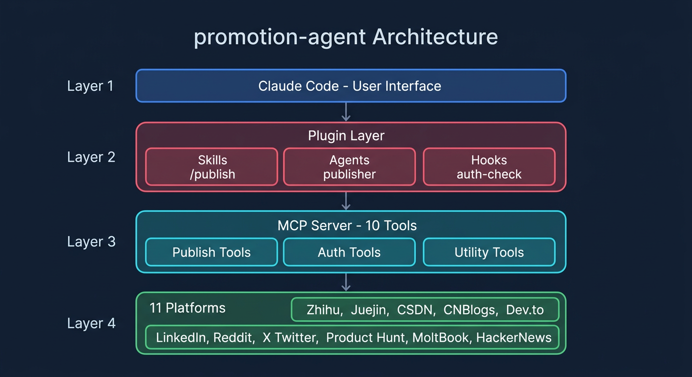

# promotion-agent

Claude Code Plugin for multi-platform content publishing via MCP.

Supports **22 platforms**: **知乎** · **掘金** · **CSDN** · **小红书** · **微信公众号** · **微博** · **V2EX** · **SegmentFault** · **OSCHINA** · **博客园** · **X/Twitter** · **Medium** · **Hashnode** · **Dev.to** · **Reddit** · **LinkedIn** · **Product Hunt** · **Hacker News** · **MoltBook** + **AI Directories** (TAAFT · Futurepedia · Toolify)

## Installation

```bash
# Clone to Claude Code plugins directory
git clone https://github.com/ava-agent/promotion-agent ~/.claude/plugins/promotion-agent

# Install Python dependencies
cd ~/.claude/plugins/promotion-agent
pip install -e .
```

Restart Claude Code after installation. The plugin loads automatically via `plugin.json`.

## Configuration

```bash
cd ~/.claude/plugins/promotion-agent
cp .env.example .env
# Fill in your platform credentials (see guides below)
```

## Platform Status

| Platform | Auth Type | Method | Stability |
|----------|-----------|--------|-----------|
| 知乎 | Cookie | API | Stable |
| 掘金 | Cookie | API (draft + manual publish fallback) | Good |
| CSDN | Cookie | API (WAF may block, manual fallback) | Limited |
| 小红书 | QR Login | External MCP proxy | Stable |
| 微信公众号 | AppID/Secret | External MCP proxy | Stable |
| 微博 | OAuth 2.0 | API | Stable |
| V2EX | Token | API | Stable |
| SegmentFault | Cookie | API | Stable |
| OSCHINA | Cookie | API | Stable |
| 博客园 | API Token | MetaWeblog XML-RPC | Stable |
| X/Twitter | OAuth 1.0a | API (tweepy) | Stable |
| Medium | Integration Token | REST API v1 | Stable |
| Hashnode | PAT | GraphQL | Stable |
| Dev.to | API Key | REST API | Stable |
| Reddit | OAuth 2.0 | API (praw) | Stable |
| LinkedIn | OAuth 2.0 | REST API | Stable |
| Product Hunt | Bearer Token | GraphQL | Stable |
| Hacker News | Username/Password | Web form scraping | Fragile |
| MoltBook | API Key | API | Stable |
| TAAFT | None | Form submission | Best-effort |
| Futurepedia | None | Form submission | Best-effort |
| Toolify | None | Form submission | Best-effort |

---

## Credential Setup

### Cookie-Based Platforms (知乎 / 掘金 / CSDN / SegmentFault / OSCHINA)

These platforms use browser Cookie authentication.

**Auto-extract (recommended):**
```bash
# Ensure you're logged in to the platform in Chrome
python3 get_cookies.py
```

**Manual extract:**
1. Log in to the platform in your browser
2. F12 → Network tab → refresh → click any request
3. Copy the `Cookie` header value

```bash
PROMOTE_ZHIHU_COOKIE=_xsrf=xxx; z_c0=xxx; ...
PROMOTE_JUEJIN_COOKIE=sessionid=xxx; ...
PROMOTE_CSDN_COOKIE=UserName=xxx; uuid=xxx; ...
PROMOTE_SEGMENTFAULT_COOKIE=...
PROMOTE_OSCHINA_COOKIE=...
```

> Cookies expire every 1-3 months. Re-extract when auth errors occur.

---

### X / Twitter

Choose direct OAuth or Xquik.

For direct OAuth:

1. Visit [developer.x.com](https://developer.x.com), create Project + App
2. Enable OAuth 1.0a with **Read and Write** permissions
3. Generate Access Token & Secret

```bash
PROMOTE_X_PROVIDER=direct
PROMOTE_X_CONSUMER_KEY=your_consumer_key
PROMOTE_X_CONSUMER_SECRET=your_consumer_secret
PROMOTE_X_ACCESS_TOKEN=your_access_token
PROMOTE_X_ACCESS_TOKEN_SECRET=your_access_token_secret
```

For Xquik, create an API key and select a connected account:

```bash
PROMOTE_X_PROVIDER=xquik
PROMOTE_XQUIK_API_KEY=your_xquik_api_key
PROMOTE_XQUIK_ACCOUNT=your_connected_account
```

---

### Medium

1. Visit [medium.com/me/settings/security](https://medium.com/me/settings/security)
2. Generate an Integration Token

```bash
PROMOTE_MEDIUM_INTEGRATION_TOKEN=your_token
```

---

### Hashnode

1. Visit [hashnode.com/settings/developer](https://hashnode.com/settings/developer)
2. Generate a Personal Access Token

```bash
PROMOTE_HASHNODE_TOKEN=your_token
PROMOTE_HASHNODE_PUBLICATION_ID=your_pub_id  # Optional, auto-discovered if omitted
```

---

### Dev.to

1. Visit [dev.to/settings/extensions](https://dev.to/settings/extensions)
2. Generate a DEV Community API Key

```bash
PROMOTE_DEVTO_API_KEY=your_api_key
```

---

### LinkedIn

1. Visit [linkedin.com/developers](https://www.linkedin.com/developers), create an App
2. Request **Share on LinkedIn** permission
3. Obtain an OAuth 2.0 Access Token (scope: `w_member_social`)

```bash
PROMOTE_LINKEDIN_ACCESS_TOKEN=your_access_token
```

> Token expires in 60 days. Re-obtain when expired.

---

### Product Hunt

1. Visit [Product Hunt API Dashboard](https://www.producthunt.com/v2/oauth/applications)
2. Create application, get API Token

```bash
PROMOTE_PRODUCTHUNT_TOKEN=your_token
```

---

### Reddit

1. Visit [reddit.com/prefs/apps](https://www.reddit.com/prefs/apps)
2. Create a **script** type app (redirect: `http://localhost:8080`)

```bash
PROMOTE_REDDIT_CLIENT_ID=your_client_id
PROMOTE_REDDIT_CLIENT_SECRET=your_client_secret
PROMOTE_REDDIT_USERNAME=your_username
PROMOTE_REDDIT_PASSWORD=your_password
```

---

### 博客园 (CNBlogs)

1. Visit [cnblogs.com settings](https://i.cnblogs.com/settings)
2. Enable MetaWeblog access and generate API Token

```bash
PROMOTE_CNBLOGS_BLOG_URL=https://www.cnblogs.com/your-blog-name
PROMOTE_CNBLOGS_USERNAME=your_username
PROMOTE_CNBLOGS_TOKEN=your_api_token
```

---

### Hacker News

```bash
PROMOTE_HN_USERNAME=your_username
PROMOTE_HN_PASSWORD=your_password
```

> Uses web form scraping (no official API). May break if HN changes its HTML.

---

### MoltBook

```bash
PROMOTE_MOLTBOOK_API_KEY=your_api_key
```

---

### 微博 (Weibo)

Requires a Weibo Open Platform app (needs approval).

```bash
PROMOTE_WEIBO_ACCESS_TOKEN=your_access_token
```

> Token expires in ~30 days.

---

### V2EX

1. Visit [v2ex.com/settings/tokens](https://www.v2ex.com/settings/tokens)
2. Generate a Personal Access Token

```bash
PROMOTE_V2EX_TOKEN=your_token
```

---

### 微信公众号 (WeChat)

```bash
PROMOTE_WECHAT_APP_ID=your_app_id
PROMOTE_WECHAT_APP_SECRET=your_app_secret
```

---

### 小红书 (Xiaohongshu)

Auth managed by external MCP proxy. Use `auth_qr_login` tool to scan QR code.

---

### AI Directories (TAAFT / Futurepedia / Toolify)

No authentication required. Submissions are HTTP form posts.

---

## Architecture

This project is a **Claude Code Plugin** embedding an **MCP Server**.



| Layer | Component | Purpose |
|-------|-----------|---------|
| **Interaction** | Skills (`/publish`) | Guide user through publish flow: select platforms, preview, confirm, publish |
| **Automation** | Agents (`publisher`) | Read content files, split by platform, batch publish, report results |
| **Security** | Hooks (`auth-check`) | `PreToolUse` intercept on all `publish*` calls - validate auth before publishing |
| **Execution** | MCP Server (`server.py`) | 12 tools, launched as subprocess via `plugin.json` |
| **Platform** | Platform classes | Each platform implements `adapt_content()` + `post()` + `health_check()` |

## MCP Tools Reference

### Publish Tools (6)

| Tool | Description | Key Parameters |
|------|-------------|----------------|
| `publish_zhihu` | Publish to Zhihu column | `title`, `body`, `column?`, `topics?`, `dry_run?` |
| `publish_x` | Tweet or thread on X | `text`, `thread?`, `url?`, `hashtags?`, `dry_run?` |
| `publish_xiaohongshu` | Post to Xiaohongshu | `title`, `body`, `images?`, `tags?`, `dry_run?` |
| `publish_wechat` | Publish to WeChat | `title`, `body`, `cover_image?`, `digest?`, `dry_run?` |
| `publish` | **Generic** - any of 18 platforms | `platform`, `title`, `body`, `tags?`, `url?`, `metadata?`, `dry_run?` |
| `submit_directory` | Submit to AI directory | `directory`, `name`, `url`, `description`, `category?`, `pricing?`, `dry_run?` |

> All publish tools support `dry_run: true` for preview without posting.

### Auth Tools (4)

| Tool | Description |
|------|-------------|
| `auth_status` | Show auth status for all platforms |
| `auth_set_cookie` | Save a cookie to .env (`platform`, `cookie`) |
| `auth_qr_login` | QR code login for Xiaohongshu |
| `auth_health_check` | Verify credentials are valid (`platform`) |

### Utility Tools (2)

| Tool | Description |
|------|-------------|
| `list_platforms` | List all platforms with auth status |
| `preview_content` | Preview content adaptation per platform (`title`, `body`, `platforms?`) |

## Usage in Claude Code

### Natural Language

```
> Publish this article to Zhihu
> Post README.md to Dev.to and Medium
> Share this to all configured platforms
```

### /publish Skill (Interactive)

```
> /publish
```

Guides you through: identify content, select platforms, check auth, preview, confirm, publish.

For `*-社媒版.md` files, auto-splits by `## ` headings into per-platform content.

### Publisher Agent (Batch)

```
> Batch publish this to all platforms
```

Autonomous agent: reads content, checks auth, previews all, waits for confirmation, publishes sequentially, reports summary table.

## Troubleshooting

### Plugin not loaded

```bash
ls ~/.claude/plugins/promotion-agent/plugin.json  # Must exist
# Restart Claude Code
```

### MCP Server not starting

```bash
cd ~/.claude/plugins/promotion-agent
pip install -e .
python server.py  # Should start and wait for stdio input
```

### Cookie expired

Cookies expire every 1-3 months. Re-extract:
```bash
python3 get_cookies.py
```

### Juejin API "parameter error"

Juejin's publish API may reject requests. The system creates a draft - visit [juejin.cn/editor/drafts](https://juejin.cn/editor/drafts) to publish manually.

### CSDN 403 Forbidden

CSDN's WAF may block API calls. Use the CSDN web editor to publish manually when this occurs.

### Auth hook blocking calls

If `publish` calls are blocked, run `auth_status` to see what's missing, then configure the required credentials.

Xquik is an independent third-party service. Not affiliated with X Corp. "Twitter" and "X" are trademarks of X Corp.

## License

[MIT](LICENSE)
