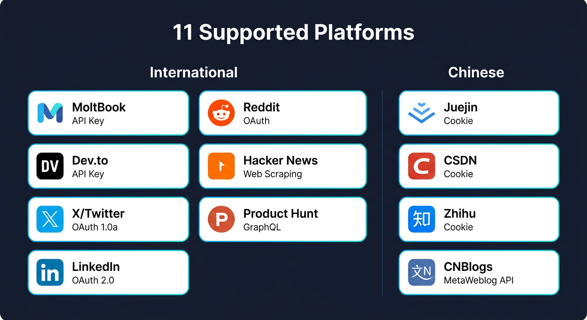
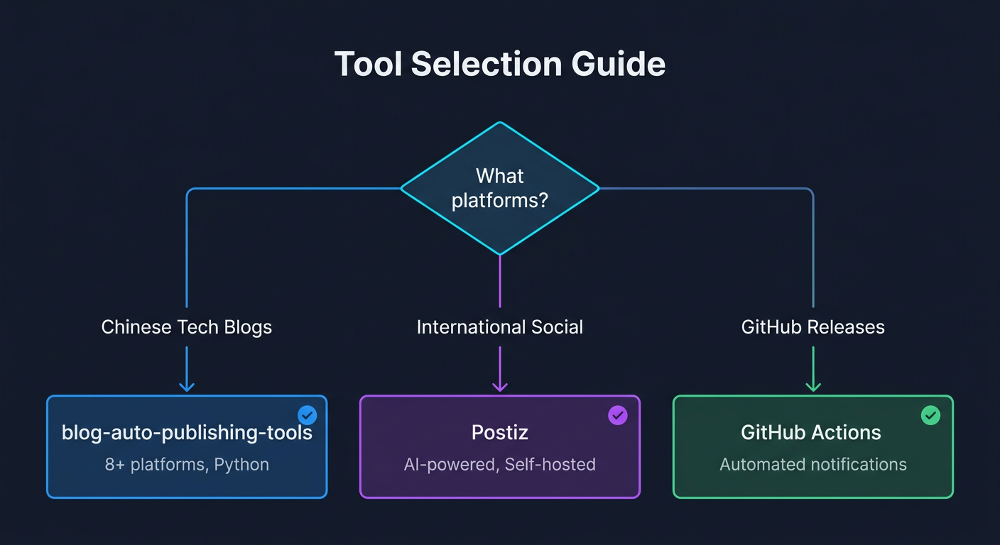
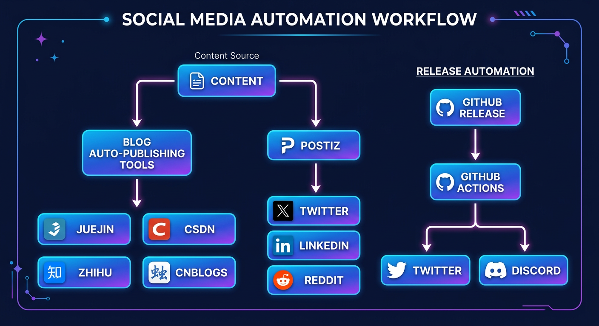
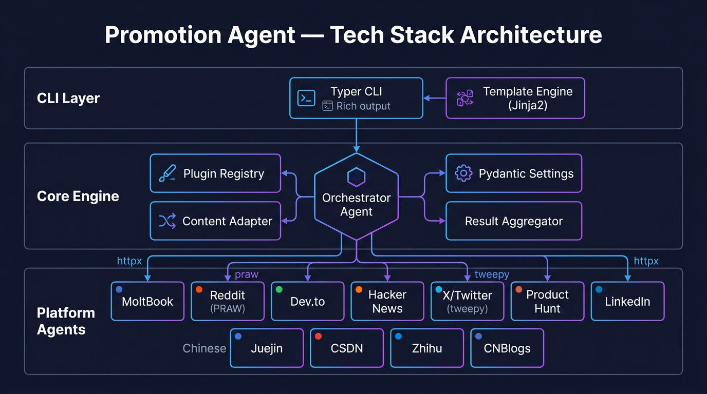
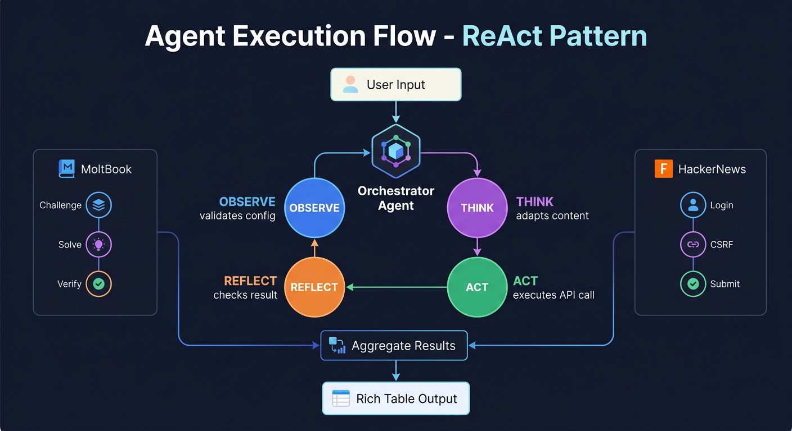
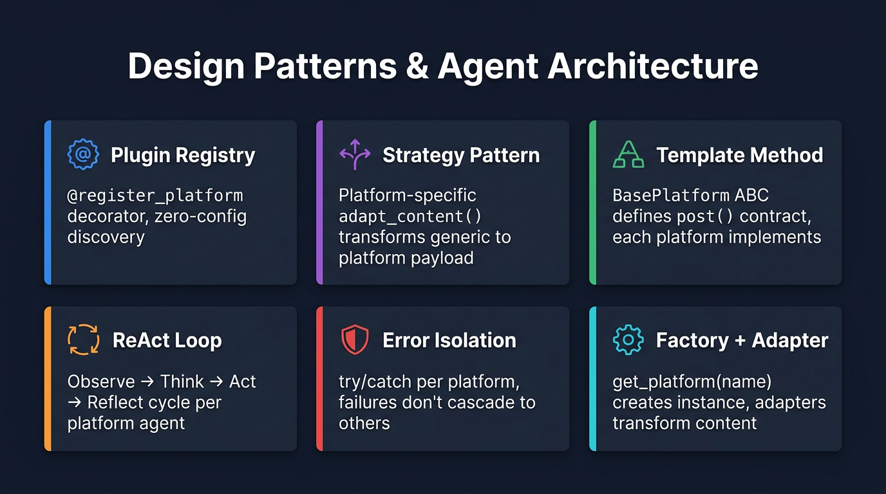
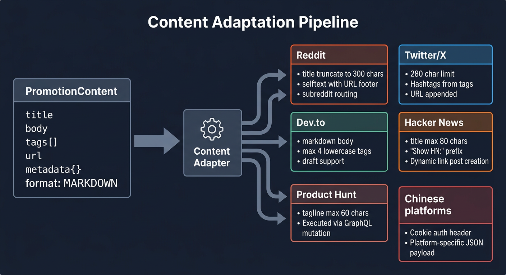

# Promotion Agent

[](https://www.python.org/downloads/)
[](https://opensource.org/licenses/MIT)
[](#recommended-tools)

> **This project is now a curated tool recommendation list.**
>
> After research, we found more mature open-source solutions. Use the tools below instead of reinventing the wheel.

---

## Supported Platforms (Reference)



---

## Recommended Tools

### Chinese Platforms (Juejin / CSDN / Zhihu / CNBlogs)

| Tool | Platforms | Features |
|------|----------|------|
| **[blog-auto-publishing-tools](https://github.com/ddean2009/blog-auto-publishing-tools)** | Juejin, CSDN, Zhihu, CNBlogs, SegmentFault, InfoQ, 51CTO, Toutiao | Python scripts, one-click publish to 8+ platforms |

```bash
# Install
git clone https://github.com/ddean2009/blog-auto-publishing-tools.git

# Usage
python publish.py --platform juejin,csdn,zhihu --file article.md
```

---

### International Platforms (Twitter / LinkedIn / Reddit)

| Tool | Stars | Platforms | Features |
|------|-------|----------|------|
| **[Postiz](https://github.com/gitroomhq/postiz-app)** | 25,000+ | Twitter, LinkedIn, Reddit, Instagram, TikTok, YouTube, Discord | AI-powered, self-hosted, Buffer alternative |
| **[social-media-agent](https://github.com/langchain-ai/social-media-agent)** | 1,400+ | Twitter, LinkedIn | By LangChain, AI content generation |
| **[Socioboard](https://github.com/socioboard/Socioboard-5.0)** | 1,000+ | Facebook, Twitter, LinkedIn, Instagram | Enterprise-grade, team collaboration |

---

### GitHub Auto-Publishing

| Tool | Purpose |
|------|------|
| **[ethomson/send-tweet-action](https://github.com/ethomson/send-tweet-action)** | Auto-tweet on GitHub Release |
| **[sarisia/actions-status-discord](https://github.com/sarisia/actions-status-discord)** | Release notifications to Discord |

```yaml
# .github/workflows/release.yml
on: release
jobs:
  tweet:
    runs-on: ubuntu-latest
    steps:
      - uses: ethomson/send-tweet-action@v1
        with:
          status: "New release: ${{ github.event.release.name }}"
          consumer_key: ${{ secrets.TWITTER_API_KEY }}
```

---

## Tool Selection Guide



| Requirement | Recommended Tool |
|------|----------|
| Chinese tech blog publishing | **blog-auto-publishing-tools** |
| International platforms + AI | **Postiz** or **social-media-agent** |
| GitHub Release automation | **GitHub Actions** |
| Enterprise team collaboration | **Socioboard** |
| Video platforms (Douyin/Bilibili) | [social-auto-upload](https://github.com/dreammis/social-auto-upload) |

---

## Architecture: Recommended Workflow



---

## Tech Stack & Agent Architecture

This project's reference implementation demonstrates several AI agent design patterns.

### Tech Stack Architecture

Three-layer design: CLI Layer (Typer + Rich + Jinja2) → Core Engine (Orchestrator Agent + Plugin Registry + Content Adapter + Pydantic Settings) → Platform Agents (11 specialized agents with httpx/praw/tweepy).



### Agent Execution Flow — ReAct Pattern

Each platform agent follows a **ReAct (Reason + Act)** loop:

1. **Observe** — Validate config, check platform health
2. **Think** — Adapt content to platform-specific format and constraints
3. **Act** — Execute API call (REST / OAuth / Web Scraping / Challenge-Response)
4. **Reflect** — Check result, handle errors, capture PostResult

Complex platforms implement multi-step agent workflows:
- **MoltBook**: Challenge → Solve (math) → Verify (ReAct with reasoning)
- **Hacker News**: Login → CSRF extraction → Form submit (stateful web agent)



### Design Patterns

| Pattern | Implementation |
|---------|---------------|
| **Plugin Registry** | `@register_platform` decorator, zero-config discovery |
| **Strategy Pattern** | Platform-specific `adapt_content()` transforms generic → platform payload |
| **Template Method** | `BasePlatform` ABC defines `post()` contract, each platform implements |
| **ReAct Loop** | Observe → Think → Act → Reflect cycle per platform agent |
| **Error Isolation** | try/catch per platform, failures don't cascade to others |
| **Factory + Adapter** | `get_platform(name)` creates instance, adapters transform content |



### Content Adaptation Pipeline

Generic `PromotionContent` (title, body, tags, url, metadata) flows through platform-specific adapters that enforce constraints:

- **Reddit**: Title ≤ 300 chars, selftext with URL footer, subreddit routing
- **Twitter/X**: ≤ 280 chars total, hashtags from tags, URL appended
- **Dev.to**: Full markdown, max 4 lowercase tags, draft support
- **Hacker News**: Title ≤ 80 chars, "Show HN:" prefix, link post
- **Product Hunt**: Tagline ≤ 60 chars, GraphQL mutation
- **Chinese Platforms**: Cookie auth header, platform-specific JSON payload



---

## Resources

### Tutorials
- [blog-auto-publishing-tools setup guide](https://m.blog.csdn.net/gitblog_00974/article/details/147503658)
- [Postiz self-hosted deployment](https://www.toutiao.com/article/7489041338576208394/)
- [GitHub Actions Twitter integration](https://m.blog.csdn.net/gitblog_01036/article/details/152499233)

### Video Platforms
- [social-auto-upload](https://github.com/dreammis/social-auto-upload) - Douyin, Bilibili, Weishi, TikTok

### AI-Powered
- [social-media-agent](https://github.com/langchain-ai/social-media-agent) - By LangChain

---

## Archive Notes

This project (promotion-agent) was originally a custom social media publishing tool supporting 11 platforms. After research:

1. **Chinese platforms**: [blog-auto-publishing-tools](https://github.com/ddean2009/blog-auto-publishing-tools) has broader coverage (8+ platforms)
2. **International platforms**: [Postiz](https://github.com/gitroomhq/postiz-app) is more powerful (AI + self-hosted)
3. **GitHub integration**: GitHub Actions ecosystem is already mature

We recommend using these mature solutions directly. This project's code is preserved as reference and is no longer actively maintained.

---

## License

[MIT](LICENSE)
